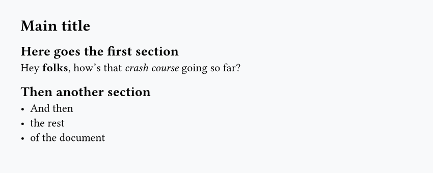
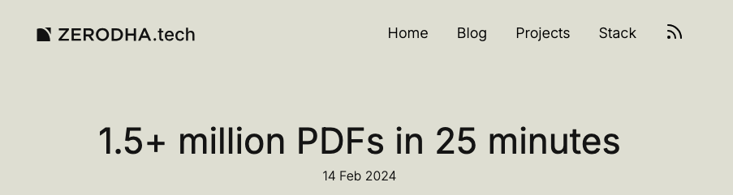

## Typst is weird...

- It's a markup language: like markdown, HTML, LaTeX...
- With scripting features: for loops, if/else statements, functions...
- And a unique syntax!

## But it's simple

```typ
= Main title

== Here goes the first section
Hey *folks*, how's that _crash course_ going so far?

== Then another section
- And then
- the rest
- of the document
```



## A bit of history

<br>

- 2019: very beginning of Typst
- 2023: Typst becomes open source
- 2026: *"I do consider Typst ready for production use"*, Typst lead dev
  - +50k Gitub stars
  - +4k commits
  - +400 contributors

## A bit of context

<br>

Typst is very fast, thanks to Rust



## A bit of context

<br>

- Typst is 2 things:
  - a compiler
  - a language (or "typesetting system")

<br>

- And typst is a **real** language, with a real **toolchain**:
  - semantic highlighting
  - code formatting and linting
  - language server
    - inlay hints
    - go to definition
    - hover to doc
    - ...


## How to use Typst

### Web app

The web app offers an _it just works_ experience since everything happens in your browser:

::: {.nonincremental}
- no installation
- instant preview
- auto-completion
- collaboration
- And other features!
:::

### Text editor

The other option is to work locally inside a text editor. For this, you'll need to [install the Typst compiler](https://typst.app/open-source/). It's also recommended that you install [Tinymist](https://myriad-dreamin.github.io/tinymist/frontend/main.html), which is a language service for Typst.

# Demo