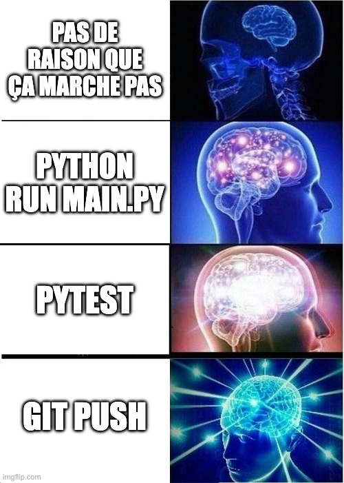

TODO

- QR code to access slides online

 
 
 

## Plan

### 1 - A propos

- joseph
- yellow sunflower

### 2 - Un bon package et le mauvais package

Un bon package c'est pas vraiment une question de code.

Quand on utilise un package, on veut juste que ça fasse ce que ça dit que ça fait, et rapidement!

### 3 - C'est quoi un bon package alors ?

- donne envie d’être utilisé
- inspire confiance
- bien documenté
- s’installe sans surprise

### 4 - TOC

Votre package a besoin de ces 4 choses, la 3ème va vous surprendre !

- Ne jamais commit une erreur
- Tester dans les meilleures conditions
- ~~Créer la meilleure documentation~~
- Configuration du `pyproject.toml`

### Ne jamais commit une erreur

- Git
- pre-commit
- hooks les plus classiques
- créer ses propres hooks!

### Tester dans les meilleures conditions

- github actions
- tester
  - sur plusieurs versions
  - plusieurs OS
  - tout le temps!

### La documentation

### Configuration du pyproject.toml

utiliser uv!

- dependencies
  - open source VS closed source
  - dev dependencies

### Partage du template

https://github.com/y-sunflower/python-package-template
