## A propos

<br>

:::: {.columns}

::: {.column width="35%"}
{.circle}
<div style="font-size:1.3em;">

   <a href="https://ysunflower.com">ysunflower.com</a>

</div>
:::

::: {.column width="15%"}
:::

::: {.column width="50%"}
<div style="font-size: 1.2em;">
   Consulting 

   Open source 

   
</div>
:::

::::

## Pourquoi venir parler de Rust ?

<br>
<br>

<div style="font-size: 1.3em">

- *Pas pour vous dire que c'est mieux que R*
- *Pas pour vous dire que vous devez re-écrire vos projets en Rust*

</div>

::: {.fragment}
<center>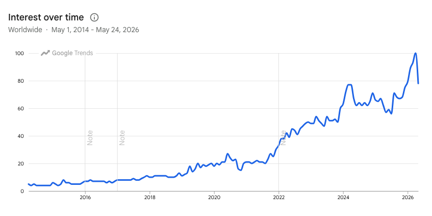</center>
:::

## Pourquoi venir parler de Rust ?

<br>

:::: {.columns}

::: {.column width="60%"}
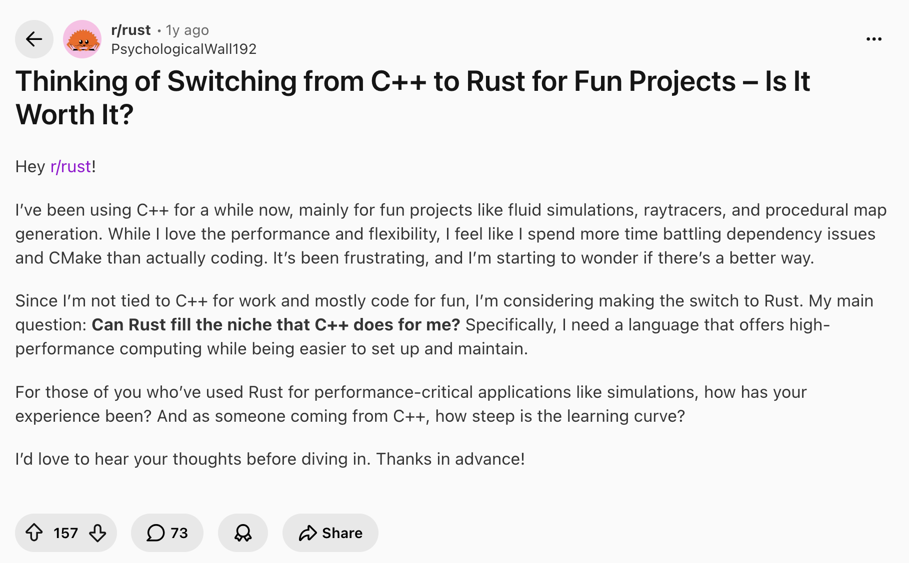
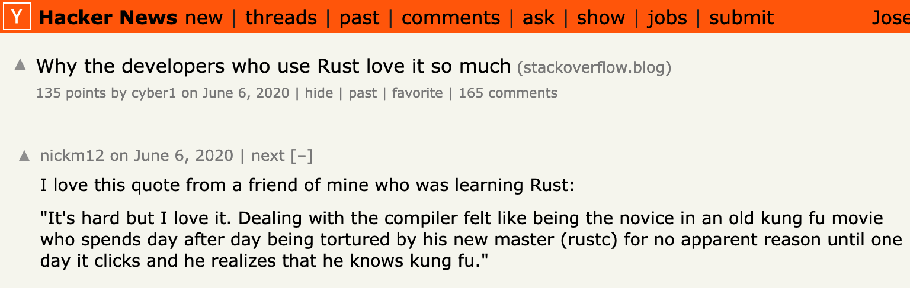
:::


::: {.column width="40%" .nonincremental}
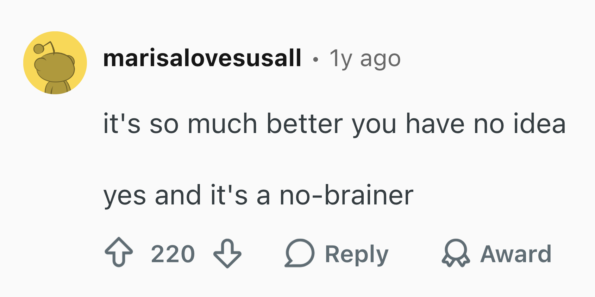

<br>
<br>
  
- **Open source** : Linux, Firefox, Deno, ...

- **Industrie** : Windows, AWS, Dropbox, Cloudflare, Discord, Datadog, ...

:::
::::

## Pourquoi venir parler de Rust ?

- Comprendre les outils qu'on utilise
- Donner envie d'essayer


# D'où ça vient ?

## Performance (⚠️⚠️⚠️)

<center>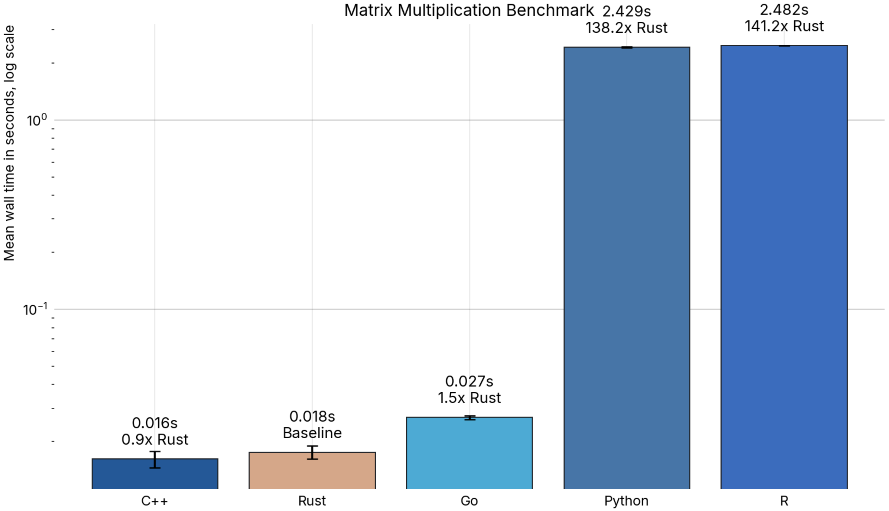</center>

## Memory safety

```{.rs code-line-numbers="|2|3|5-6"}
fn main() {
    let s1 = String::from("hello");
    let s2 = s1;

    println!("{}", s1);
    println!("{}", s2);
}
```

<br>

::: {.fragment}

```rs
error[E0382]: borrow of moved value: `s1`
 --> /Users/josephbarbier/l/talk/src/rencontresR2026/script.rs:5:20
  |
2 |     let s1 = String::from("hello");
  |         -- move occurs because `s1` has type `String`, which does not implement the `Copy` trait
3 |     let s2 = s1;
  |              -- value moved here
4 |
5 |     println!("{}", s1);
  |                    ^^ value borrowed here after move
  |
help: consider cloning the value if the performance cost is acceptable
  |
3 |     let s2 = s1.clone();
  |                ++++++++
```

:::

## Type safety

```{.rs code-line-numbers="|2|3|5"}
fn main() {
    let x: i32 = 10;
    let y: &str = "20";

    let result = x + y;
}
```

<br>

::: {.fragment}

```rs
error[E0277]: cannot add `&str` to `i32`
 --> /Users/josephbarbier/l/talk/src/rencontresR2026/script2.rs:5:20
  |
5 |     let result = x + y;
  |                    ^ no implementation for `i32 + &str`
  |
  = help: the trait `Add<&str>` is not implemented for `i32`
  = help: the following other types implement trait `Add<Rhs>`:
            `&i32` implements `Add<i32>`
            `&i32` implements `Add`
            `i32` implements `Add<&i32>`
            `i32` implements `Add`
```

:::

<br>
<br>

- *"Oui mais en R aussi j'aurai une erreur"*


## Expérience développeur

<video autoplay loop muted>
  <source src="./rust-usage.mp4" type="video/mp4">
</video>

## Ecosystème Python

::: {.nonincremental}

- `uv`: package/project manager
- `ruff`: linter & formatter
- `ty`: type checker
- `pyrefly`: type checker
- `polars`: data manipulation
- `pydantic`: data validation
- `monty`: interpreter
- `prek`: pre-commit hook
- **et plein d'autres!**

:::

# R ❤️ Rust : ça existe déjà<br>(et ça marche)

## Rust dans l'écosystème R

::: {.nonincremental}

- `Ark`: kernel R (utilisé dans Positron IDE)
- `Air`: formatter et serveur de langage
- `Jarl`: linter
- `yaml12`: YAML parser
- `polars`: R interface à polars
- **et plein d'autres !**

:::

## Projet en développement

::: {.panel-tabset}

### `q2`

<center>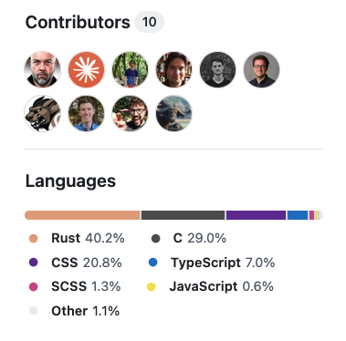</center>

### `rv`

<center>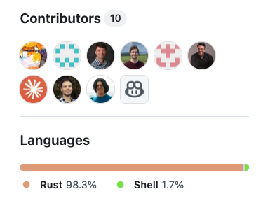</center>

### `ggsql`

<center>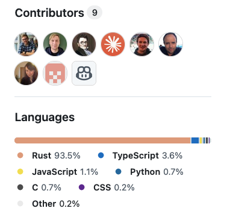</center>

:::

## Connecter R et Rust avec `extendr`

<center style="border: 1px solid black">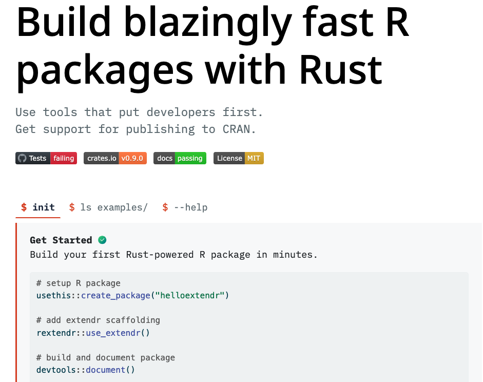</center>

## 

<br>


```{.rs code-line-numbers="|1|3-7|9-12"}
use extendr_api::prelude::*;

/// @export
#[extendr]
fn hello() -> &'static str {
    "Hello RencontresR 2026 !"
}

extendr_module! {
    mod helloextendr;
    fn hello;
}
```

<br>

::: {.fragment}

```{.r code-line-numbers="1-2|4-5"}
devtools::document() # build package
devtools::load_all() # load package

hello()
#> "Hello RencontresR 2026 !"
```

:::


## Est-ce que je dois arrêter R pour faire du Rust ?

<br>

:::: {.columns}

::: {.column width="50%"}
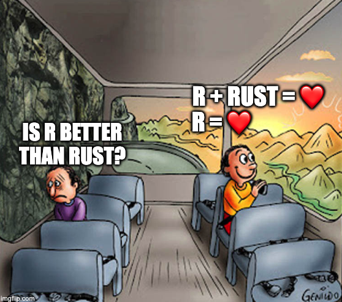
:::

::: {.column width="50%"}
- Rust ne remplace(ra) pas R
- Rust fonctionne très bien avec R
- Rust <u>peut</u> remplacer C/C++
- Rust ne résoudra pas tous vos problèmes
- Il est probable que vous n'ayez même **pas besoin de Rust** 😳
:::
::::

## Un mot sur l'IA

<center>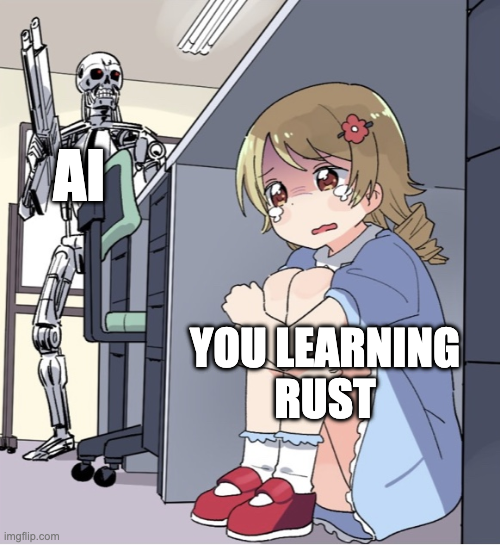</center>

##

<div style="display: flex; justify-content: center; font-size: 3em;">
Merci !
</div>

J'ai dit des choses fausses ?

::: {.nonincremental}
- venez m'en parler !
:::

J'ai dit des choses pertinentes ?

::: {.nonincremental}
- venez m'en parler !
:::

<br>

Autres ?

::: {.nonincremental}
- venez me voir !
- linkedin: Joseph Barbier
- mail: `joseph@ysunflower.com`
- slides: [github.com/JosephBARBIERDARNAL/talk](https://github.com/JosephBARBIERDARNAL/talk/tree/main/src/rencontresR2026)
:::
