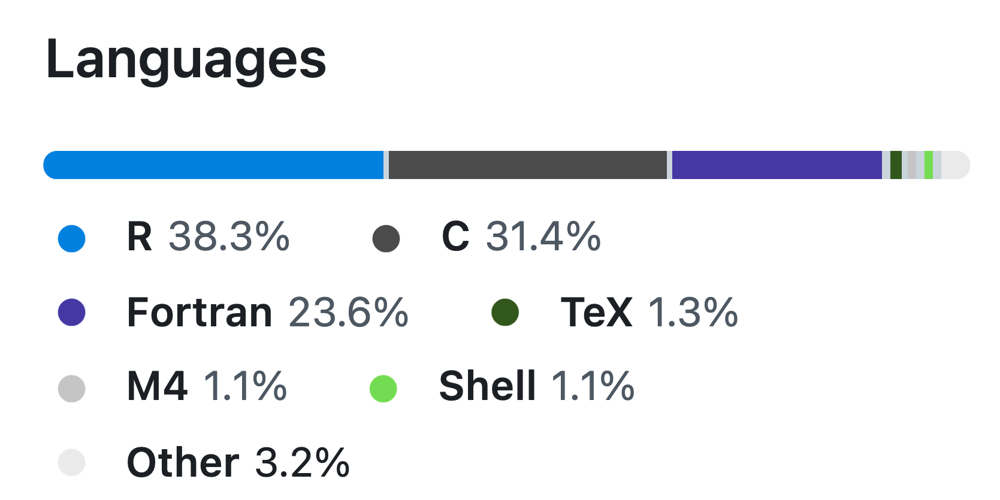

## A propos

<br>

:::: {.columns}

::: {.column width="35%"}
{.circle}
<div style="font-size:0.9em;">
   *Joseph*

   <br><br>

   <a href="https://barbierjoseph.com">barbierjoseph.com</a>

   <a href="https://ysunflower.com">ysunflower.com</a>

</div>
:::

::: {.column width="15%"}
:::

::: {.column width="50%"}
<div style="font-size: 1.2em;">
   Consulting

   Open source

   Data(viz)

   
</div>
:::

::::

## Pourquoi venir parler de Rust ?

<br>


:::: {.columns}

::: {.column width="60%"}

:::


::: {.column width="40%"}

:::
::::

Language qui gagne en popularité

- sur des gros projets (Linux, Firefox, Windows, Deno, ...)
- et dans l'industrie

## R ce n'est pas que R

<center></center>

<br>

<center><span style="font-size: 1.2em; background-color: #caf0f8">R est principalement écrit en C et Fortran</span></center>


## Les languages se parlent: R et C

```c
#include <R.h>
#include <Rinternals.h>

SEXP add_two(SEXP x) {
    double val = REAL(x)[0];
    SEXP result = PROTECT(Rf_allocVector(REALSXP, 1));
    REAL(result)[0] = val + 2.0;
    UNPROTECT(1);
    return result;
}
```

<br>

Ensuite on compile avec `R CMD SHLIB example.c`, puis on utilise `.Call()`:

<br>

```R
dyn.load("example.so")

.Call("add_two", 41)
#> 43
```

- Un peu compliqué...
- Mais techniquement possible

## R et C++ avec `{Rcpp}`

```cpp
#include <Rcpp.h>
using namespace Rcpp;

// [[Rcpp::export]]
double add_two(double x) {
  return x + 2;
}
```

<br>

Et côté R :

<br>

```R
library(Rcpp)
sourceCpp("example.cpp")

add_two(42)
```

<br>

- Beaucoup plus simple !
- Utilisé par pleins de packages R (~2 millions installations/mois)

## R et Rust

```rs
use std::os::raw::c_double;

#[no_mangle]
pub extern "C" fn add_two(x: *mut c_double) {
    unsafe {
        *x = *x + 2.0;
    }
}
```

<br>

On compile avec `cargo build`, et ensuite:

<br>

```R
dyn.load("target/release/libexample.dylib")

add_two <- function(x) {
    .C("add_two", as.double(x))[[1]]
}

add_two(41)
```

- Compliqué et très "hacky"
- Pas très R friendly
- Pas safe

# Essor de Rust

## Ecosystème Python

- `uv`: package/project manager
- `ruff`: linter & formatter
- `ty`: type checker
- `pyrefly`: type checker
- `polars`: data manipulation
- `pydandic`: data validation
- `monty`: interpreter
- `prek`: pre-commit hook
- **et plein d'autres!**

# D'où ça vient?

## Performance

<center></center>

## Safety

<br>

- Mémoire
- Type

  - Pleins de bugs classiques sont attrapés **avant** de lancer le programme

## Expérience développeur

<video autoplay loop>
  <source src="./rust-usage.mp4" type="video/mp4">
</video>

# R ❤️ Rust : ça existe déjà<br>(et ça marche)

## Rust dans l'écosystème R

- `Ark`: kernel R (utilisé dans Positron)
- `Air`: formatter et serveur de language
- `Jarl`: linter
- `yaml12`: YAML parser
- `polars`: R interface à polars
- **et plein d'autres !**

## Projet en développement

- `Quarto v2`: réecriture de Quarto en Rust
- `rv`: package manager
- `ggsql`: SQL et grammaire des graphiques

# Et si vous utilisiez Rust ?

## 2 manières différentes d'utiliser Rust

- Créer un programme en Rust qu'on peut appeler depuis R 
- Créer un programme qu'on ne peut **pas** appeler depuis R --> Plus dur et concerne souvent des outils "fondations"

## Comment on appelle Rust depuis R


<br>

## ✨extendr✨

- Ecrire une fonction en Rust
- Exposer cette fonction à R
- Appeler la fonction depuis R

## Est-ce que je dois arrêter R pour faire du Rust ?

##

<div style="display: flex; justify-content: center; font-size: 3em;">
Merci !
</div>

J'ai dis des choses fausses ?

::: {.nonincremental}
- venez m'en parler !
:::

J'ai dis des choses pertinentes ?

::: {.nonincremental}
- venez m'en parler !
:::

<br>

Autres ?

::: {.nonincremental}
- venez me voir !
- linkedin: Joseph Barbier
- mail: `joseph@ysunflower.com`
- slides: [github.com/JosephBARBIERDARNAL/talk](https://github.com/JosephBARBIERDARNAL/talk/tree/main/src/rencontresR2026)
:::
