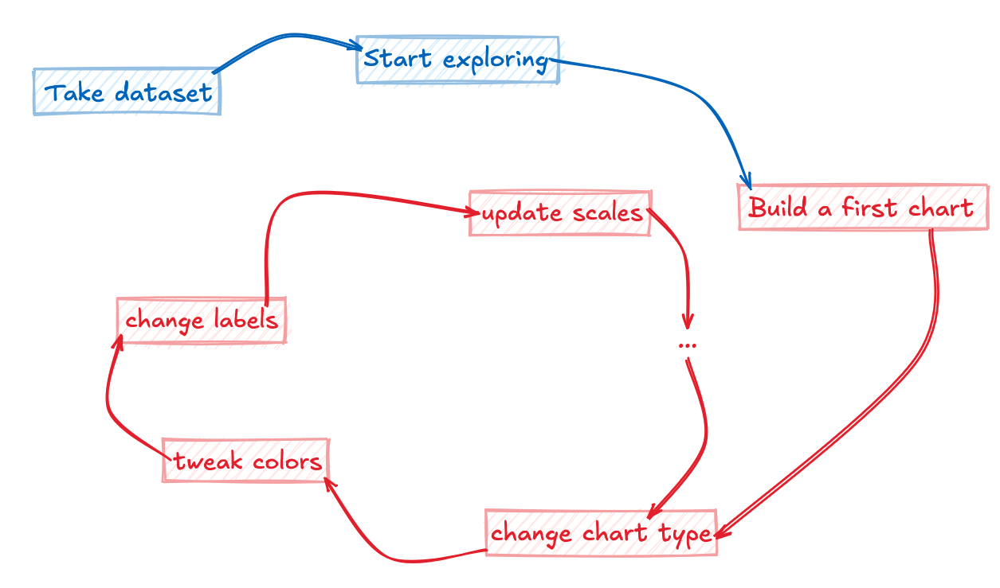
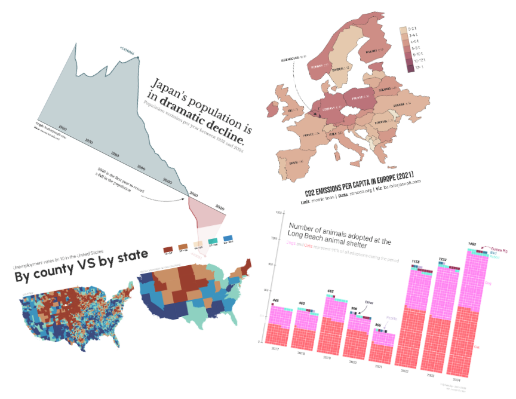
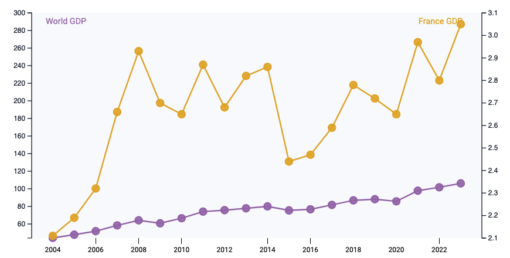
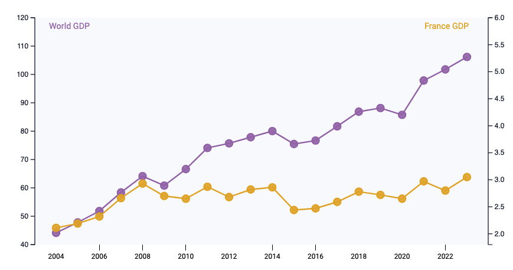
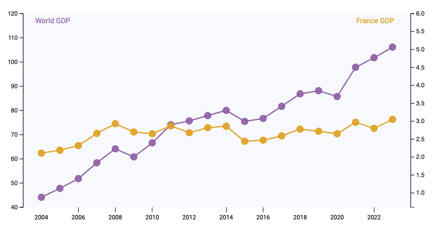
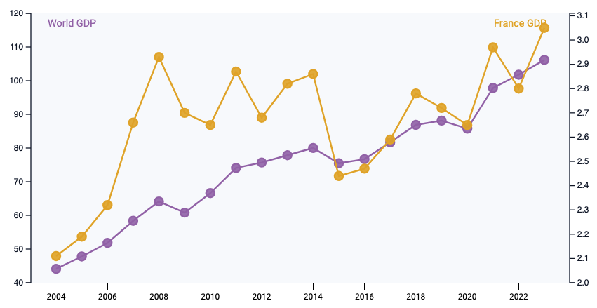
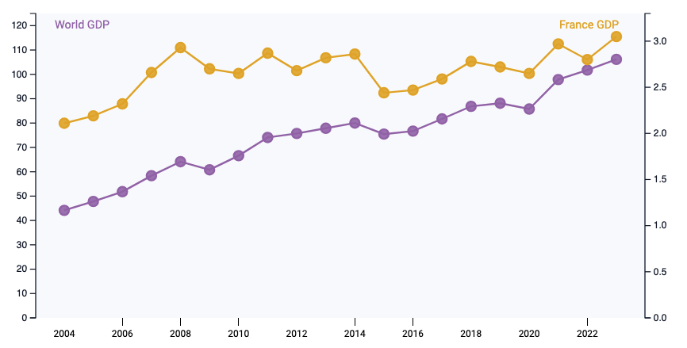
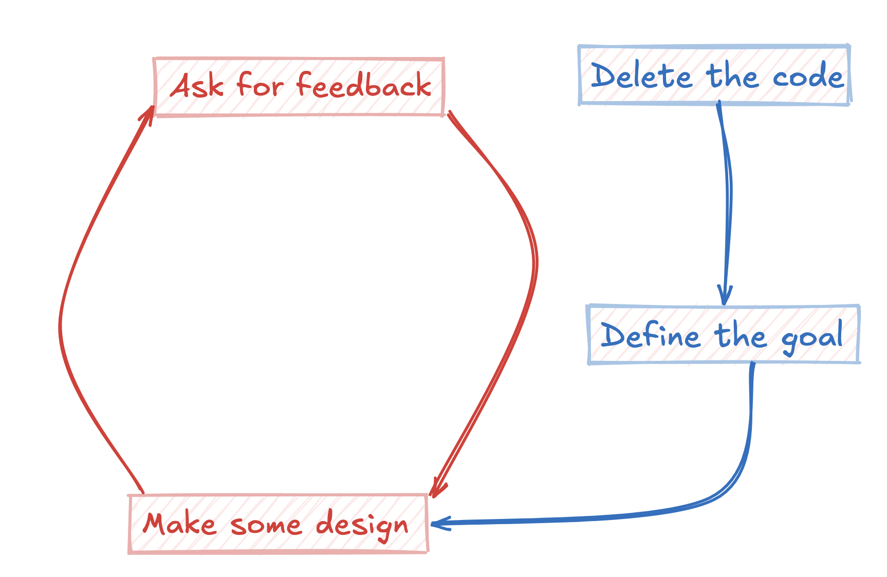
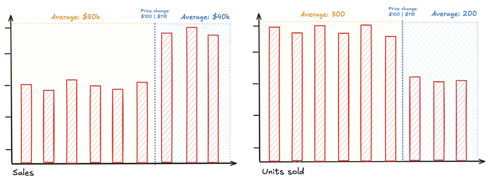

```{r}
#| fig-height: 5
#| echo: false
library(tidyverse)
library(scales)
library(patchwork)
library(gt)

set.seed(123)

n_weeks <- 52 * 3
end_date <- Sys.Date()
start_date <- end_date - (n_weeks - 1) * 7

dates <- seq.Date(from = start_date, by = "week", length.out = n_weeks)

price_change_date <- end_date - 120
price_change_idx <- which(dates >= price_change_date)[1]

base_price <- 100
price <- rep(base_price, n_weeks)
price[price_change_idx:n_weeks] <- 120 # stronger increase

price <- price + rnorm(n_weeks, 0, 1)

unit_sold <- 320 - 1.1 * (price - base_price) + rnorm(n_weeks, 0, 5)

# force a visible drop right after change
unit_sold[price_change_idx:n_weeks] <- unit_sold[price_change_idx:n_weeks] *
    0.96

df <- tibble(
    date = dates,
    price = round(price, 2),
    unit_sold = unit_sold
) |>
    mutate(sales = price * unit_sold)
```


## We're doing things all wrong...

- Iteration has always been part of chart-making
- AI has accelerated this loop dramatically
- **But faster iteration ≠ better outcomes**

<br>

- We should invert the process → **design first, code last**

## The default workflow

<center></center>

## Why this feels natural

- Tools/AI encourage it: *"I'll just ask AI to do it to see how it looks"*
- Immediate feedback loop
- Feels productive (but is it?)

## Instead

> *Why does this chart need to exist?*

- **Audience** → who is this for?
- **Message** → what should they understand?
- **Decision / action** → what changes after seeing it?

# Design before code


## About

<br>

:::: {.columns}

::: {.column width="35%"}
{.circle}
<div style="font-size:0.9em;">
   *Joseph*

   <br><br>

   <a href="https://barbierjoseph.com">barbierjoseph.com</a>

   <a href="https://ysunflower.com">ysunflower.com</a>

</div>
:::

::: {.column width="15%"}
:::

::: {.column width="50%"}
<div style="font-size: 1.2em;">
   Consulting

   Open source

   Data(viz)

   
</div>
:::

::::

## Example

```{r}
#| fig-height: 5
df |> head() |> gt()
```

**Context**:

- The company increased price a few months ago from ~$100 to ~$115
- Management wants to know the impact
- *What should we do?*

## Let's check units sold

```{r}
#| fig-height: 5
ggplot(df, aes(x = date, y = unit_sold)) + geom_line()
```

Much less units sold!

## How about sales?

```{r}
#| fig-height: 5
ggplot(df, aes(x = date, y = sales)) + geom_line()
```

But much more sales!

## Let's compare them!

```{r}
#| fig-height: 5
ggplot(df, aes(x = date)) +
    geom_line(aes(y = unit_sold)) +
    geom_line(aes(y = sales))
```

Wait, what?

## Let's put them next to each other

```{r}
#| fig-height: 5
units_sold <- ggplot(df, aes(x = date, y = unit_sold)) + geom_line()
sales <- ggplot(df, aes(x = date, y = sales)) + geom_line()
units_sold + sales
```

What a diff! Oh wait, the scale is weird!

## Adjust the scale

```{r}
#| fig-height: 4
units_sold <- ggplot(df, aes(x = date, y = unit_sold)) +
    geom_line() +
    ylim(0, NA)
sales <- ggplot(df, aes(x = date, y = sales)) + geom_line() + ylim(0, NA)
units_sold + sales
```

Better, but most data is useless here

## Reduce time period

```{r}
#| fig-height: 4
df_filter <- df |> filter(date >= "2025-01-01")
units_sold <- ggplot(df_filter, aes(x = date, y = unit_sold)) +
    geom_line() +
    ylim(0, NA)
sales <- ggplot(df_filter, aes(x = date, y = sales)) + geom_line() + ylim(0, NA)
units_sold + sales
```

The trend isn't really obvious now...

## Let's try to put them on the same chart

```{r}
#| fig-height: 5
#| echo: false
ggplot(df_filter, aes(x = date)) +
    geom_line(aes(y = unit_sold, color = "Units sold")) +
    geom_line(aes(y = sales / 100, color = "Sales")) +
    scale_y_continuous(
        name = "Units sold",
        sec.axis = sec_axis(~ . * 100, name = "Sales")
    ) +
    scale_color_manual(values = c("Units sold" = "blue", "Sales" = "red")) +
    labs(x = NULL, color = NULL)
```

##

::: {.panel-tabset}

### Scenario 1



### Scenario 2



### Scenario 3



### Scenario 4



### Scenario 5



:::

Sources:

::: {.nonincremental}
- [react-graph-gallery.com](https://www.react-graph-gallery.com/example/dual-y-axis-interactive)
- [datawrapper.com](https://www.datawrapper.de/blog/dualaxis)
:::

## But how do I compare them now?

<br>
<br>

### "Your scientists were so preoccupied with whether or not they could, that they didn't stop to think if they should." *Jurassic Park*

## Maybe we don't need to?

```{r}
#| fig-height: 5
p <- ggplot(df_filter, aes(x = date, y = sales)) +
    geom_line() +
    ylim(30000, 36500)
p
```

This chart with some better styling and annotations should work

## Change the theme

```{r}
#| fig-height: 5
p <- p + theme_minimal()
p
```

## Remove labels

```{r}
#| fig-height: 5
p <- p + xlab("") + ylab("")
p
```

## Update labels

```{r}
p <- p +
    scale_y_continuous(labels = label_dollar(scale = 1e-3, suffix = "K")) +
    scale_x_date(labels = label_date("%b, %Y"), date_breaks = "3 months")
p
```

## Increase their size

```{r}
p <- p +
    theme(
        axis.text.x = element_text(size = 10),
        axis.text.y = element_text(size = 12, face = "bold")
    )
p
```

## Highlight new price

<br>

```{r}
#| echo: false
p <- p +
    annotate(
        "rect",
        xmin = as.Date("2025-11-15"),
        xmax = Inf,
        ymin = -Inf,
        ymax = Inf,
        fill = "lightblue",
        alpha = 0.2
    ) +
    annotate(
        "text",
        x = as.Date("2026-02-01"),
        y = 35700,
        label = "Price went from $100 to $115",
        color = "#457b9d"
    )

p
```

## Remove x grid

<br>

```{r}
#| echo: false
p <- p +
    theme(
        panel.grid.minor = element_blank(),
        panel.grid.major = element_blank(),
        panel.grid.major.y = element_line(
            color = "#caf0f8",
            size = 0.5,
            alpha = 0.5,
            linetype = 1
        )
    )
p
```

## Move to the right

```{r}
#| echo: false
p <- p +
    scale_y_continuous(
        labels = label_dollar(scale = 1e-3, suffix = "K"),
        position = "right"
    )
p
```

Getting better!

## A colleague comes...

<br>

*"I think it's important to also show units sold and management want a barplot!"*

<br>
<br>

::: {.incremental}
- Wait, so we need to start over?
- Ok let's do a barplot then!
- But what if management change their mind?
:::

## Let's do it differently



## Define the goal

- **Goal**: impact of price change on:
   - units sold --> are we selling less? and by how much?
   - sales --> are we making more/less? and by how much?

## Make some design

<br>

::: {.incremental}
*Only rule: don't rush it!*
:::

- Figma
- Canva
- Excalidraw (personal preference)
- Pen and paper
- <span style="color: red; font-weight: normal;">It doesn't matter! Use whatever you prefer</span>

## Make some design

<center></center>

- This takes much less time
- Ask for feedback
- And repeat!

## Make some design

<br>
<br>

😱 Zero line of code! Are we not productive???

- We just did **the hard part**

## Now we can code

- With AI
    - Weak prompt: *"Show sales evolution"*
    - Strong prompt: *"Create a barplot for period X, highlight Y, remove Z, compare A and B, ..."*
- Without AI
    - Much easier too!

## Framework

-  <span style="font-weight: normal">Define intent</span>
   - Who? What? Why?

-  <span style="font-weight: normal">Define the design</span>
   - If you can't visualize it, you're not ready to code yet!

-  <span style="font-weight: normal">Feedback</span>
   - Ask colleagues, managers, etc

-  <span style="font-weight: normal">Code</span>

## When is it okay to code first?

- Get an overview of the data
    - AI can be very useful here
- Design is already clear

##

<div style="display: flex; justify-content: center; font-size: 3em;">
Thanks for listening!
</div>

<br>

Did I say something wrong?

::: {.nonincremental}

- come chat!

:::

Did I say anything relevant?

::: {.nonincremental}

- come chat!

:::

<br>

Other?

::: {.nonincremental}

- LinkedIn: Joseph Barbier
- email: `joseph@ysunflower.com`
- slides: [github.com/JosephBARBIERDARNAL/talk](https://github.com/JosephBARBIERDARNAL/talk/tree/main/src/rome-r-users-group)

:::

