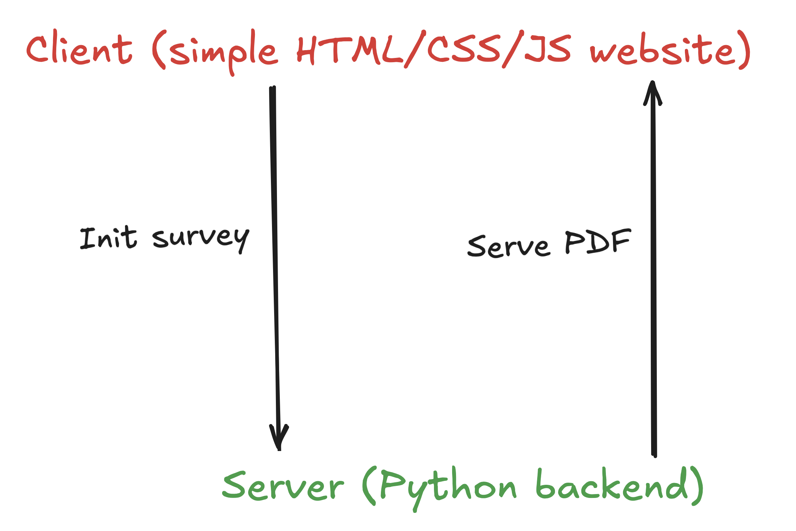
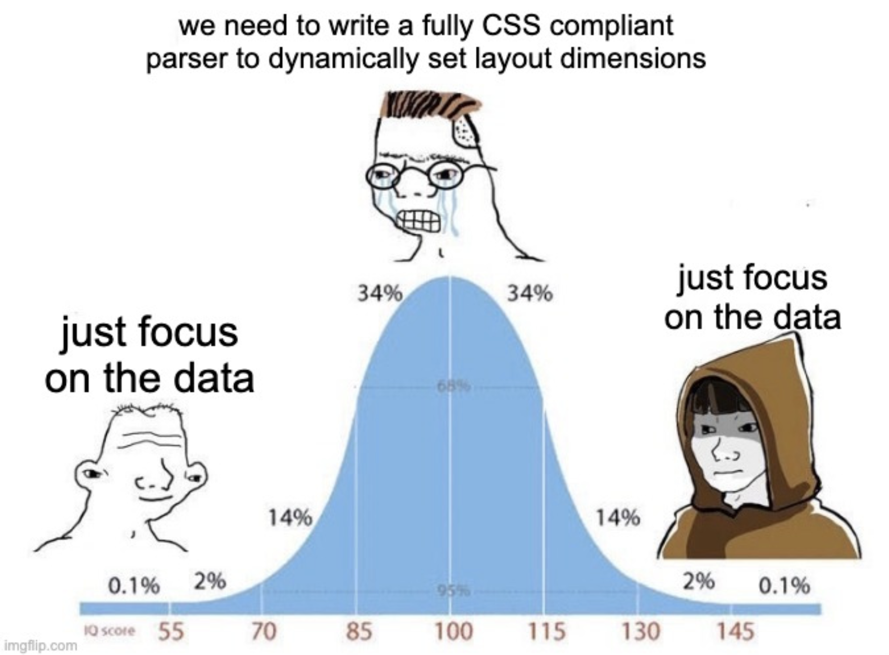

# ~~*Typst*~~ Data science in production

## This is not about Typst*...

*(\*thanks to Typst!)*

<center>{width="35%"}</center>

- I don't have any tips
- No best-practice recommendations
- TLDR: if you're here, you likely know more Typst than me!

## ... it's all about reproducibility

<br><br>

<div style="font-size:2.5rem;"> 

::: {.incremental}
- Will it work on someone else's machine?
- Will it work 1 year from now?
- Will it work with new data?
- Can someone less technical run it too?
:::

</div>

## About

<br>

:::: {.columns}

::: {.column width="35%"}
{.circle}
<div style="font-size:0.9em;">
   *Joseph*

   <br><br>

   <a href="https://barbierjoseph.com">barbierjoseph.com</a>

   <a href="https://ysunflower.com">ysunflower.com</a>

</div>
:::

::: {.column width="15%"}
:::

::: {.column width="50%"}
<div style="font-size: 1.2em;">
   Consulting

   Open source

   Data(viz)

   
</div>
:::

::::

## Projects

<br>
<br>

<div style="font-size:2.5rem;">
  - 1 - Typst on the client
  - 2 - Typst on the server
</div>


# 1 - Child vaccination in the US

## Project description

:::: {.columns}

::: {.column width="40%"}

:::

::: {.column width="20%"}
:::

::: {.column width="25%"}

***made with Clarity Data Studio***
:::

::::

<br>

<div style="font-size: 2.5rem;">
  - 50 reports (1 per US state)
  - **Stack**: R + Quarto
</div>

## Quarto

<br>
<br>
<br>
<br>

<center></center>

## Reports


## How it works


## Now

<br>

<div style="font-size:2rem;">
Single R script that:

  - installs dependencies
  - renders 50 reports
  - puts them into a Google Drive
</div>

## Learn more about this project

<br>
<br>
<br>

<div style="font-size: 2.5rem;">

Code + Data + Doc

[github.com/claritydatastudio/state-immunization-reports](https://github.com/claritydatastudio/state-immunization-reports)

</div>

# 2 - Assessing psychosocial risks among French workers

## Context: psychosocial risk assessment at work


<div style="font-size: 2.5rem;">
  - French employers are legally required to assess psychosocial risks, but:
    - enforcement is limited
    - practical guidance is often unclear
    - external consulting can be expensive
</div>


## Approach

<div style="font-size: 2.5rem;">
- Run an anonymous survey across the company
- Build a report from the responses

That's the core idea.
</div>


## In practice, it's more complex...

<div style="font-size: 2.5rem;">
- Survey is long (70+ questions)
- Results must be easy to consume (charts, summary, etc.)
- Fully anonymous
- Actionable (what should we do next?)
</div>

## Solution



## What about Typst?

We run Typst on the backend using [typst-py](https://github.com/messense/typst-py)

```python
import json
import typst

# ID of the company
companyid = get_company_id() 

# create PNG files for the report
generate_all_chart(companyid) 

# summary, what to do next, etc
insights = generate_insights(companyid) 

sys_inputs = {
  "companyid": json.dumps(companyid)
  "insights": json.dumps(insights)
}
typst.compile(
    "src/document/template.typ",
    output="report.pdf",
    sys_inputs=sys_inputs,
)
```

## Tech stack (PoC, not stable)

- Backend: Python (FastAPI for the API, matplotlib for dataviz, polars & sqlalchemy for data, ...)
- Frontend: native HTML/CSS/JS
- DB: Postgres

--> Future stack (?):

- React/Next on the frontend, for simplicity
- Rust (framework TBD) for the backend because performance and memory usage can be issues here

> Have thoughts? Please share them!


# What Typst lets me do

## I'm not a software developer

- I _love_ to code, but...
- My clients do not care about my tech stack, they just want to "consume" data easily
- I don't want code to be a limiting factor for what I'm trying to do


## How I used to make PDFs\*

:::: {.columns}

::: {.column width="50%"}
```css
.toc a::after {
  content: target-counter(attr(href), page);
  float: right;
  background: var(--background-color);
}
```
:::

::: {.column width="45%"}
```css
.toc .leaders::before {
  content: "";
}
.toc-section-number {
  margin-right: 15px;
  font-family: var(--secondary-font);
}
```
:::

::::

<br>

:::: {.columns}

::: {.column width="50%"}
```css
#TOC li {
  border-top: 1px solid #ccc !important;
  padding: 5pt;
  list-style-type: none;
}
#TOC li a {
  color: var(--primary-color) !important;
  text-decoration: none;
}
```
:::
::: {.column width="10%"}
:::
::: {.column width="30%"}

:::

::::

<br>

*\*real code used by some of my clients*

## Typst makes me forget about the report

<div style="font-size: 2rem;">
  - I create a Typst template with the design I want, and that's it!
    - it's easy and fast
    - bindings everywhere
  - I can just focus on what matters to the clients/users
</div>



## Related projects

<br>

<div style="font-size: 1.5em;">
  - Check out [typst-in-production.com](https://typst-in-production.com/) (**github.com/y-sunflower/typst-in-production**)
  - `r2typ`: an R package for generating Typst and compiling from R (**github.com/y-sunflower/r2typ**)
</div>

##

<div style="display: flex; justify-content: center; font-size: 3em;">
Thanks for listening!
</div>

<br>

Did I say something wrong?

::: {.nonincremental}

- come chat!

:::

Did I say anything relevant?

::: {.nonincremental}

- come chat!

:::

<br>

Other?

::: {.nonincremental}

- LinkedIn: Joseph Barbier
- email: `joseph@ysunflower.com`
- slides: [github.com/JosephBARBIERDARNAL/talk](https://github.com/JosephBARBIERDARNAL/talk/tree/main/src/typst-meetup-2026)

:::
