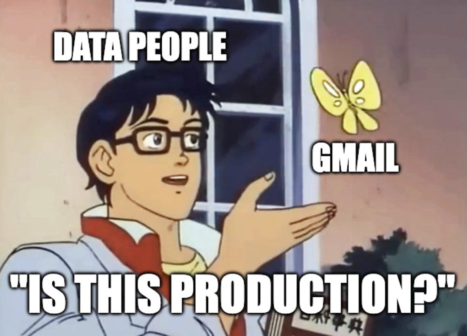
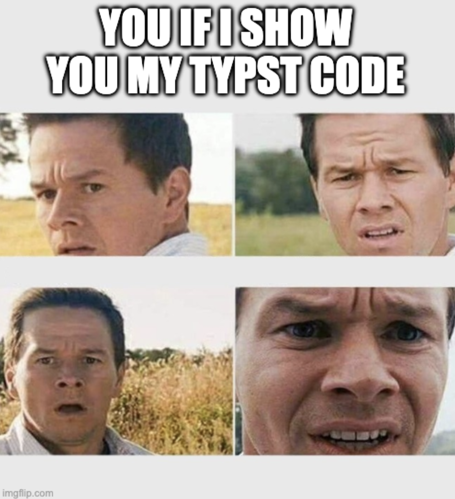
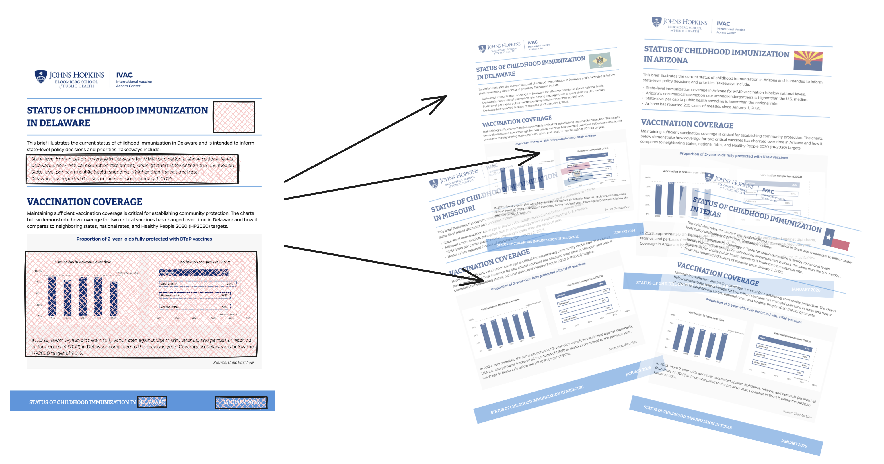
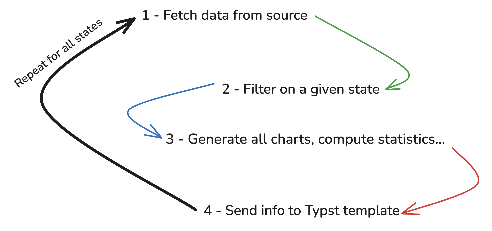
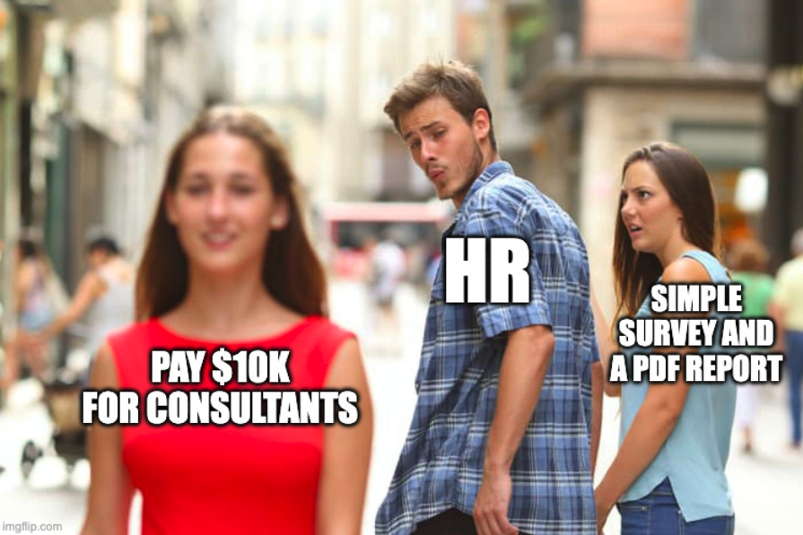
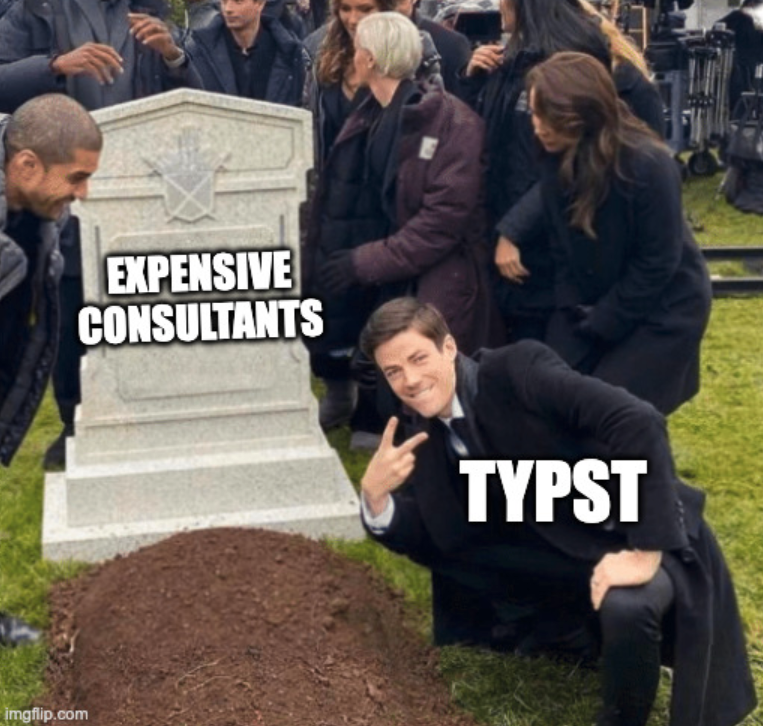
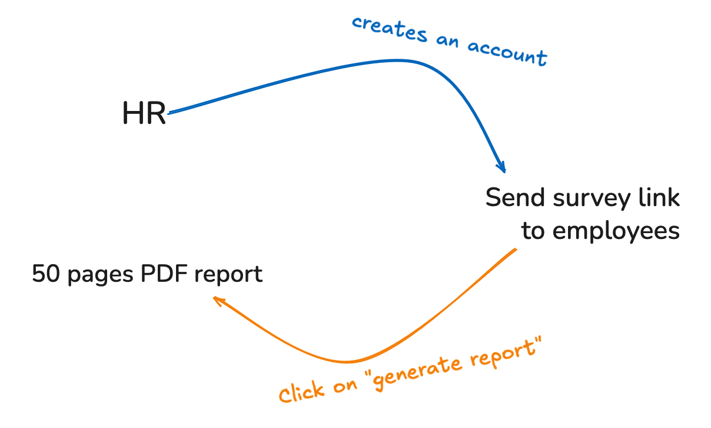
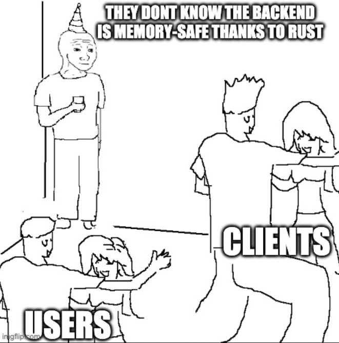

## About

<br>

:::: {.columns}

::: {.column width="35%"}
{.circle}
<div style="font-size:0.9em;">
   *Joseph*

   <br><br>

   <a href="https://barbierjoseph.com">barbierjoseph.com</a>

   <a href="https://ysunflower.com">ysunflower.com</a>

</div>
:::

::: {.column width="15%"}
:::

::: {.column width="50%"}
<div style="font-size: 1.2em;">
   Consulting

   Open source

   Data(viz)

   
</div>
:::

::::

# Data science in production

## But... "typst in production"?

<br><br>

:::: {.columns}

::: {.column width="50%"}

:::


::: {.column width="50%"}
<br>
<br>
<span style="font-size: 2rem;">PRODUCTION = WHERE USERS ARE</span>
:::

::::

## This is not about Typst*...

*(\*thanks to Typst!)*

<center>{width="35%"}</center>

- I don't have any tips
- No best practices recommendation
- TLDR: if you're here, you likely know more Typst than me!

## ... it's all about reproductibility

<br><br>

<div style="font-size:2.5rem;"> 

::: {.incremental}
- Will it work on someone's else machine?
- Will it work 1 year from now?
- Will it work with new data?
- Can someone less technical run it too?
:::

</div>

# Child vaccination in the US

## Project description

:::: {.columns}

::: {.column width="40%"}

:::

::: {.column width="20%"}
:::

::: {.column width="25%"}

***made with Clarity Data Studio***
:::

::::

<br>

- 50 reports (1 per US state)
- Open source + open data + public reports
- Stack: R + Quarto

## Reports



## How it works



# Fun fact

<div style="font-size:2rem;">
  When we finished the code to generate the reports, we were told that they couldn't use them because they were **not fully accessible**.
  
  At the **exact same time**, Typst 0.14.0rc1 was just released with tons of accessibility work, which saved us!
</div>

## Learn more about this project

<br>
<br>
<br>

<div style="font-size: 2.5rem;">

Code + Data + Doc

[github.com/claritydatastudio/state-immunization-reports](https://github.com/claritydatastudio/state-immunization-reports)

</div>

# Measuring psychological health in France

## Context: mental health in workforce


<div style="font-size: 2.5rem;">
  - Legal obligation in France, but:
    - no consequences if you don't do it
    - not clear how to do it
    - expensive if you hire consultants
</div>




## Solution

<div style="font-size: 2.5rem;">
- Send a survey to all employees
- Make a report based on the answers

That's it!
</div>



## Well, it's a bit more complicated...

<div style="font-size: 2.5rem;">
- Survey is long (70+ questions)
- Needs to be easy to consume (charts, summary, etc)
- Fully anonymous
- Applicable (what to do next?!)
</div>

## What about Typst?

We run Typst on the backend using [typst-py](https://github.com/messense/typst-py)

```python
import json
import typst

# ID of the company
companyid = get_company_id() 

# create PNG files for the report
generate_all_chart(companyid) 

# summary, what to do next, etc
insights = generate_insights(companyid) 

sys_inputs = {
  "companyid": json.dumps(companyid)
  "insights": json.dumps(insights)
}
typst.compile(
    "src/document/template.typ",
    output="report.pdf",
    sys_inputs=sys_inputs,
)
```

## How it works



## Tech stack (PoC, not stable)

- Backend: Python (fastapi for the API, matplotlib for dataviz, polars & sqlalchemy for data, ...)
- Frontend: native HTML/CSS/JS
- DB: Postgres

--> Future stack (?):

- React/Next for the frontend for simplicity
- Rust (framework TBD) for the backend because performance and memory usage can be issues here

> Have thoughts? Please share them!


# What Typst lets me do

## I'm not a software developer

- I _love_ to code, but...
- My clients do not care about my tech stack, they just want to "consume" data easily
- I don't want code to be a limiting factor of what I'm trying to do



## Typst makes me forget about how the report is made

- I create a Typst template with the design I want, and that's it!
  - it's fast
  - easy to code (and to maintain!)
  - bindings everywhere
- I can just focus on what matters to the clients/users

## Typst in Production

<br>

<div style="font-size: 1.5em;">
  - Check out [typst-in-production.com](https://typst-in-production.com/)
  - Source on Github: [github.com/y-sunflower/typst-in-production](https://github.com/y-sunflower/typst-in-production)
</div>

##

<div style="display: flex; justify-content: center; font-size: 3em;">
Thanks for listening !
</div>

<br>

Did I say something wrong?

::: {.nonincremental}

- come chat !

:::

Did I say anything relevant?

::: {.nonincremental}

- come chat !

:::

<br>

Other ?

::: {.nonincremental}

- linkedin: Joseph Barbier
- email: `joseph@ysunflower.com`
- slides: [github.com/JosephBARBIERDARNAL/talk](https://github.com/JosephBARBIERDARNAL/talk/tree/main/src/typst-meetup-2026)

:::
